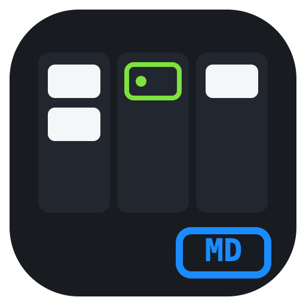
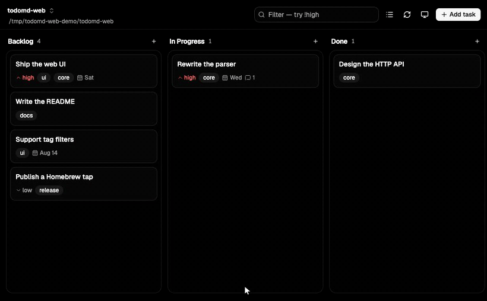

<p align="center">
  
</p>

<h1 align="center">TodoMD-Web</h1>

<p align="center">
  A Kanban web UI for <a href="https://github.com/walm/todomd">todomd</a> —
  one Go binary, no database, your <code>TODO.md</code> is still the truth.
</p>

<picture>
  <source media="(prefers-color-scheme: dark)" srcset="docs/demo.gif">
  <source media="(prefers-color-scheme: light)" srcset="docs/demo-light.gif">
  
</picture>

todomd gives agents a CLI and you a TUI. todomd-web adds the third way in:
a board you can open on a laptop or a phone, tap a card, read the agent's
comments, reply, edit and drag things around — while the agent keeps working
through the same file.

It shells out to `todomd` for **every** read and write, so there is exactly
one implementation of the file format, one lock, and one set of semantics.
Nothing here parses your markdown.

## 📦 Install

Both binaries are needed — todomd does the work, todomd-web puts a screen on
it:

```sh
curl -fsSL https://raw.githubusercontent.com/walm/todomd/main/install.sh | sh
curl -fsSL https://raw.githubusercontent.com/walm/todomd-web/main/install.sh | sh
```

Or build from source (Go 1.26+; the UI bundle is committed, so no Node
needed):

```sh
go install github.com/walm/todomd-web@latest
```

### Upgrading

```sh
todomd-web upgrade          # download the latest release and replace this binary
todomd-web upgrade --check  # just report what's available
```

It verifies the release's published sha256 and checks that the downloaded
binary actually runs before swapping it in; anything that fails leaves the
binary you have exactly where it was.

Because the board tends to stay open for weeks, todomd-web also says so **in
the UI**: a bar above the board offers **Changelog** and **Upgrade**. Upgrading
from there installs the release and restarts the server into it, then the page
reloads itself — no terminal needed. Dismissing the bar hides that version
only; the next release says hello again.

The check runs at most every six hours, from a cached answer, and never blocks
a request. `TODOMD_WEB_NO_UPDATE_CHECK=1` switches it off entirely, and a
source build never nags (or upgrades — use `git pull`).

## 🚀 Use

```sh
cd your-project
todomd-web                 # serves ./TODO.md on http://127.0.0.1:7337
todomd-web --open          # …and opens a browser
todomd-web -f ~/notes/TODO.md --port 8080 --author andreas

# several projects at once, with a switcher in the header
todomd-web ~/src/todomd/TODO.md ~/src/todomd-web/TODO.md ~/notes/house
```

| Flag | Default | What it does |
|---|---|---|
| `-f`, `--file` | the config file, else todomd's discovery | Todo file to serve; repeat it, or list paths as arguments, for several projects |
| `--config` | `$XDG_CONFIG_HOME/todomd-web/config.json` | Where the project list lives |
| `--port` | `7337` | Port on localhost |
| `--poll` | `10s` local, `30s` remote | How often an open board re-reads its file; `0` switches it off |
| `--author` | `user` | Default author recorded on comments you write |
| `--todomd` | `todomd` | Path to the todomd binary |
| `--open` | off | Open the board in your browser |
| `--dev` | — | Proxy the UI to a Vite dev server, e.g. `http://127.0.0.1:5173` |

Tasks carry todomd's **priority** — `high`, `normal` (the default) or `low`.
High and low are marked on cards and rows the way the TUI marks them, and
both forms have a picker. Type `!high` (or `priority:low`) in the filter to
see one priority only; a bare `high` still searches text, so a task called
"High contrast" is still findable. Priority needs **todomd v0.4.0 or newer**
on every machine that touches the file — older versions cannot parse the
token it writes.

On the board: click a card to open it, `n` for a new task, `/` to filter,
`r` to reload, `p` to switch project (`1`–`9` jump straight to one), and `v`
to swap between the board and a **list view** — everything in one column,
grouped under its board, which reads better on a phone than scrolling
sideways. Dragging works the same in both: a row dragged under another
heading changes board exactly as a card does. Drag cards between columns or up and down; on a phone, press
and hold briefly before dragging, or just open the card and change its board
there. Task detail is deep-linked at `/t/<id>`, so a card can be bookmarked
or shared.

Cards an agent (or the TUI, or a `git pull`) touched since you last looked
are badged — green for new, amber for changed — using `todomd changes --as
web`. Opening a card clears its badge; your own edits never raise one.

## 🗂️ Several projects

Every todo file you register is a project, and the header switches between
them. **Where the list comes from decides who owns it:**

- **Paths on the command line** (`todomd-web a/TODO.md b/TODO.md`, or a
  repeated `-f`) are the whole list, and the browser cannot change it.
- **Otherwise the config file** — `~/.config/todomd-web/config.json` — which
  the UI edits when you add or remove a project:

  ```json
  {
    "projects": [
      { "name": "todomd-web", "file": "/Users/you/src/todomd-web/TODO.md" },
      { "name": "house",      "file": "/Users/you/notes/house/TODO.md" }
    ]
  }
  ```

  `name` is optional and defaults to the directory the file sits in. With no
  config at all, todomd-web falls back to the `TODO.md` it finds from the
  working directory, and writes the file only once you change the list.

A project can also live on **another machine**, reached over ssh:

```sh
todomd-web deploy@web1:/srv/app/TODO.md ~/src/todomd-web/TODO.md
```

```json
{ "file": "deploy@web1:/srv/app/TODO.md",
  "todomd": "/home/deploy/.local/bin/todomd" }
```

Every read and write runs `todomd` on that host, so the lock, the atomic write
and the change cursor all stay where the file is — which is what makes editing
a board safe next to an agent working the same file there. Your `~/.ssh/config`
is used as-is (aliases, jump hosts, keys, ports), no credentials are stored
here, and connections are multiplexed so a request costs ~10 ms rather than a
fresh handshake.

Two things that will bite otherwise:

- **`todomd` must be on the remote PATH** — and an ssh command runs a
  *non-interactive* shell, which often skips `~/.local/bin` where the installer
  puts it. Hence the per-project `"todomd"` above; the error message says this
  too.
- **The remote host must be reachable without a prompt.** todomd-web passes
  `BatchMode=yes`, so a key needing a passphrase fails fast instead of hanging
  a request on a prompt you cannot see. If `ssh host true` works in your
  terminal, this works.

Remote projects show an `ssh` chip in the switcher, and are taken on trust
rather than checked on every listing — a broken one reports itself when you
open its board.

There is no directory scanning: paths are typed once, by you.

**Adding** takes a path — a directory means the `TODO.md` inside it — and
offers to run `todomd init` if there is nothing there yet. **Renaming** (the
pencil) is worth knowing about: names default to the folder, so two repos
with a `docs/` directory both show up as "docs" until you say otherwise. The
URL follows the new name, and so does the board you are looking at.
**Removing takes the project off the list and does nothing else: the file
stays exactly where it is.**

The switcher shows an unread count per project, so an agent working in a repo
you are not currently looking at is visible without opening it. Each project
keeps its own `todomd changes` cursor, so those counts never bleed together.

## 🔒 It listens on localhost only

todomd-web binds `127.0.0.1` and cannot be told otherwise. It has no
authentication and it creates, edits and deletes files on your machine —
publishing that port would be handing anyone on the network a shell-adjacent
capability.

**Use it on the machine the file lives on.** To reach it from your phone,
put something that does authentication and transport security in front:

```sh
tailscale serve --bg 7337        # https://<machine>.<tailnet>.ts.net, tailnet only
ssh -L 7337:127.0.0.1:7337 you@host   # or an SSH tunnel
```

Both give you the board on a phone without exposing anything to the wider
network.

## 🤝 How it works with agents

The file stays the interface. An agent runs `todomd add`, `todomd comment
--author ai`, `todomd done`, and it turns up on the board on its own: an open
board re-reads every 10 seconds (30 for a project over ssh), plus whenever the
window regains focus. The timer stops while the tab is in the background, so a
board left open on another desktop costs nothing.

Change the interval with `--poll 30s`, or in the config file — globally, or
per project for a slow link:

```json
{
  "poll": "15s",
  "projects": [
    { "file": "/Users/you/src/app/TODO.md" },
    { "file": "deploy@web1:/srv/app/TODO.md", "poll": "1m" }
  ]
}
```

`--poll 0` switches polling off entirely, leaving the focus refetch and the
refresh button. Nothing watches the filesystem either way. Concurrent writes are safe
because both processes take todomd's own advisory lock and it replaces the
file atomically.

Every request re-reads through the CLI, and every write is expressed as a
task id (`todomd update 3f2a --title …`), never as a whole-file save — so a
browser tab left open overnight cannot clobber a morning's worth of agent
work.

## 🧩 The HTTP API

The JSON is todomd's own pinned schema, passed straight through.

Every board and task route names its project, so no request depends on the
server remembering which one you are looking at.

| Method | Path | Body |
|---|---|---|
| `GET` | `/api/config` | — |
| `GET` | `/api/update` | — (cached; refreshes in the background) |
| `POST` | `/api/update` | — install the latest release and restart into it |
| `GET` | `/api/projects` | — |
| `POST` | `/api/projects` | `{file, name?, create?}` |
| `PATCH` | `/api/projects/{project}` | `{name}` — the id changes with it, so follow the response |
| `DELETE` | `/api/projects/{project}` | — (list only; the file is untouched) |
| `GET` | `/api/projects/{project}/board` | — |
| `GET` | `/api/projects/{project}/changes` | — (advances that project's `web` cursor) |
| `POST` | `/api/projects/{project}/tasks` | `{board?, title, description?, tags?, due?}` |
| `PATCH` | `/api/projects/{project}/tasks/{id}` | any of `{title, description, tags, due}`; `due: null` and `tags: []` clear |
| `POST` | `/api/projects/{project}/tasks/{id}/move` | `{to?, pos?}` — `pos` is 1-based after removal, omit to append |
| `POST` | `/api/projects/{project}/tasks/{id}/comments` | `{author, text}` |
| `DELETE` | `/api/projects/{project}/tasks/{id}` | — |

Errors come back as `{"error": "…"}` with todomd's own message: `404` no such
task, `409` ambiguous id prefix, `400` anything it rejected.

## 🎬 The demo gif

`docs/demo.gif` and `docs/demo-light.gif` are generated by
`sh docs/demo/record.sh` — one per theme, so the README shows whichever
matches your GitHub setting. See [docs/demo/README.md](docs/demo/README.md)
for what it needs and how to change what it shows.

## 🛠️ Development

```sh
mise run build          # build the UI bundle, then the binary
mise run test           # go test ./...
cd web && npm test      # vitest
```

For UI work, run the server and Vite side by side:

```sh
todomd-web &                       # or: go run . --dev http://127.0.0.1:5173
cd web && npm run dev              # proxies /api to :7337, hot-reloads the UI
```

`web/dist` is committed on purpose: the Go binary embeds it, so a clone
builds without Node. CI rebuilds it and fails if the committed copy is stale
— run `mise run build-web` and commit the result.

## 📄 License

[MIT](LICENSE)
